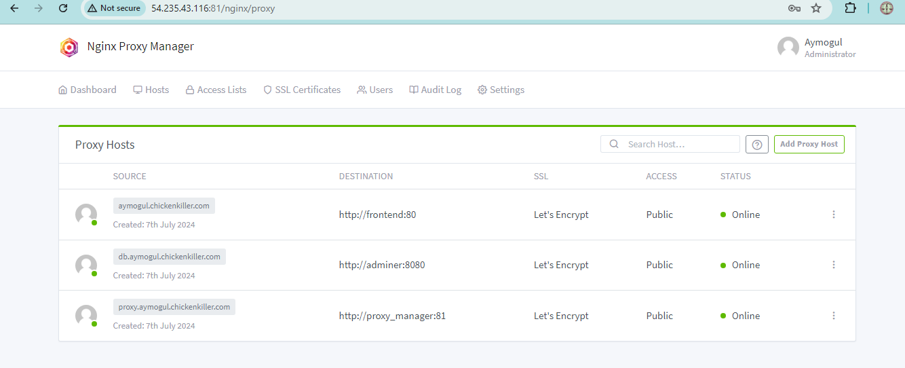

# Full-Stack FastAPI and React Template

Welcome to the Full-Stack FastAPI and React template repository. This repository serves as a demo application for interns, showcasing how to set up and run a full-stack application with a FastAPI backend and a ReactJS frontend using ChakraUI.

## Project Structure

The repository is organized into two main directories:

- **frontend**: Contains the ReactJS application.
- **backend**: Contains the FastAPI application and PostgreSQL database integration.

Each directory has its own README file with detailed instructions specific to that part of the application.

## Getting Started

To get started with this template, please follow the instructions in the respective directories:

- [Frontend README](./frontend/README.md)
- [Backend README](./backend/README.md)

## steps to deply the app
1. Dockerize the frontend
```sh
# Use an official Node.js runtime as a parent image
FROM node:16-alpine

# Set the working directory in the container
WORKDIR /app

# Copy the package.json and package-lock.json files
COPY package*.json ./

# Install dependencies
RUN npm install

# Copy the rest of the application code into the container
COPY . .

# Build the React app
RUN npm run build

# Install serve to serve the build directory
RUN npm install -g serve

# Expose the port that the app runs on
EXPOSE 3000

# Command to serve the build directory
CMD ["serve", "-s", "build"]
```


2. Dockerize the backend
```sh
# Use an official Python runtime as a parent image
FROM python:3.10-slim

# Set the working directory in the container
WORKDIR /app

# Install curl
RUN apt-get update && apt-get install -y curl

# Install Poetry
RUN curl -sSL https://install.python-poetry.org | python3 -

# Add Poetry to PATH
ENV PATH="/root/.local/bin:$PATH"

# Copy the pyproject.toml and poetry.lock files
COPY pyproject.toml poetry.lock ./

# Install dependencies
RUN poetry install --no-root

# Copy the rest of the application code into the container
COPY . .

# Expose the port that the app runs on
EXPOSE 8000

# Command to run the backend server
CMD ["poetry", "run", "uvicorn", "app.main:app", "--host", "0.0.0.0", "--port", "8000"]
```


3. docker compose file
```sh
version: '3.8'

services:
  frontend:
    build:
      context: ./frontend
    container_name: frontend
    restart: unless-stopped
    ports:
      - "3000:80"
  
  backend:
    build:
      context: ./backend
    container_name: backend
    restart: unless-stopped
    ports:
      - "8000:8000"
    environment:
      DATABASE_URL: postgres://${POSTGRES_USER}:${POSTGRES_PASSWORD}@db:5432/${POSTGRES_DB}

  db:
    image: postgres:13
    container_name: postgres
    restart: unless-stopped
    environment:
      POSTGRES_USER: ${POSTGRES_USER}
      POSTGRES_PASSWORD: ${POSTGRES_PASSWORD}
      POSTGRES_DB: ${POSTGRES_DB}
    volumes:
      - postgres_data:/var/lib/postgresql/data
    ports:
      - "5432:5432"

  adminer:
    image: adminer
    container_name: adminer
    restart: unless-stopped
    ports:
      - "8080:8080"

  proxy:
    image: 'jc21/nginx-proxy-manager:latest'
    container_name: proxy_manager
    restart: unless-stopped
    ports:
      - "80:80"
      - "81:81"
      - "443:443"
    volumes:
      - ./data:/data
      - ./letsencrypt:/etc/letsencrypt

volumes:
  postgres_data:
```
4. start a EC2 server


5. install git
```sh
sudo apt update
sudo apt install git
git clone the repo
```

6. install docker and docker compose
```sh
# Install Docker
sudo apt update
sudo apt install apt-transport-https ca-certificates curl software-properties-common -y
curl -fsSL https://download.docker.com/linux/ubuntu/gpg | sudo gpg --dearmor -o /usr/share/keyrings/docker-archive-keyring.gpg
echo "deb [arch=$(dpkg --print-architecture) signed-by=/usr/share/keyrings/docker-archive-keyring.gpg] https://download.docker.com/linux/ubuntu $(lsb_release -cs) stable" | sudo tee /etc/apt/sources.list.d/docker.list > /dev/null
sudo apt update
sudo apt install docker-ce docker-ce-cli containerd.io -y

# Install Docker Compose
sudo curl -L "https://github.com/docker/compose/releases/download/v2.18.1/docker-compose-$(uname -s)-$(uname -m)" -o /usr/local/bin/docker-compose
sudo chmod +x /usr/local/bin/docker-compose

# Verify installations
docker --version
docker-compose --version

# Ensure Docker service is running
sudo systemctl start docker
sudo systemctl enable docker
sudo systemctl status docker

# Run Docker Compose
sudo docker-compose up --build

```


7. Get sub-domain at afraidns


8. configure nginx-proxy



9. reroute the website to the proxy-manager for the domain 
```sh
location /api {
    proxy_pass http://54.235.43.116:8000/api;
    proxy_set_header Host $host;
    proxy_set_header X-Real-IP $remote_addr;
    proxy_set_header X-Forwarded-For $proxy_add_x_forwarded_for;
    proxy_set_header X-Forwarded-Proto $scheme;
}
location /docs {
    proxy_pass http://54.235.43.116:8000/docs;
    proxy_set_header Host $host;
    proxy_set_header X-Real-IP $remote_addr;
    proxy_set_header X-Forwarded-For $proxy_add_x_forwarded_for;
    proxy_set_header X-Forwarded-Proto $scheme;
}
location /redoc {
    proxy_pass http://54.235.43.116:8000/redoc;
    proxy_set_header Host $host;
    proxy_set_header X-Real-IP $remote_addr;
    proxy_set_header X-Forwarded-For $proxy_add_x_forwarded_for;
    proxy_set_header X-Forwarded-Proto $scheme;
}
```


